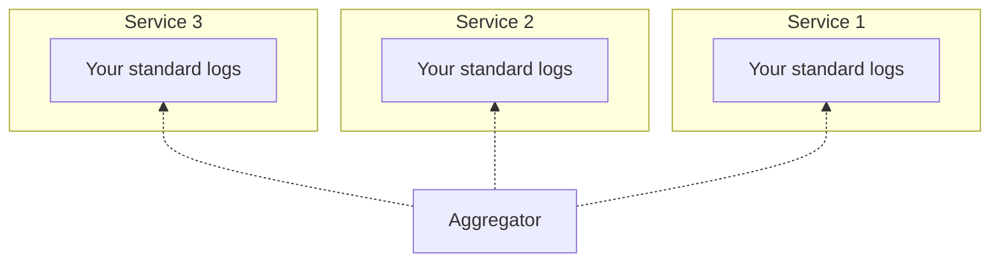

I have been building some aggregated logging mechanism in all my projects
for a few years now and I always thought of it as an industry standard practice. Lately I've noticed that that is not the case and lots people are not taking it seriously.

This post is an attempt to gather my thoughts on the subject and hopefully
help others understand it. Also, I've added a new Markdown-based chart plugin on my blog and I wanted to test it out. Here it goes.

## Why logging
OS processes that usually run web applications are always bound to the standard output. Can be a file, the terminal or a GUI made by the hosting provider. Whatever that is, I usually tend to throw a bunch of logging statements to my functions to be able to trace its execution later.

It's always useful to pack those traces with metadata. A request for password reset was initiated by a **specific user** or the creation of a **specific TODO item** failed yesterday. Hopefully, I will be able to trace back those requests and see more information.

Say for the password reset request we will end up having something like this:

```
82c838eb-736a-447b-b9e1-10dfe2bbe575 - Tue, 04 Dec 2018 20:27:16 GMT - POST /user/resetPassword - Initiated
82c838eb-736a-447b-b9e1-10dfe2bbe575 - Tue, 04 Dec 2018 20:27:16 GMT - User 145123 requested to reset password
82c838eb-736a-447b-b9e1-10dfe2bbe575 - Tue, 04 Dec 2018 20:27:16 GMT - User found, resetting password
82c838eb-736a-447b-b9e1-10dfe2bbe575 - Tue, 04 Dec 2018 20:27:16 GMT - Password resetted
82c838eb-736a-447b-b9e1-10dfe2bbe575 - Tue, 04 Dec 2018 20:27:16 GMT - Attempt to send email
82c838eb-736a-447b-b9e1-10dfe2bbe575 - Tue, 04 Dec 2018 20:27:16 GMT - Email sent
82c838eb-736a-447b-b9e1-10dfe2bbe575 - Tue, 04 Dec 2018 20:27:16 GMT - POST /user/resetPassword - 200 OK
```

The above is a simplified example but you can see the detail granularity that we have already. We could easily spot an exception thrown in the middle of the process, find out its the exact time and in general reason about our system's behavior.

Of course, the above will quickly result to lots of lots of logs especially in a high traffic environment. Fortunately, there are the tools that will help us find the information we need much easier.

## Why aggregated
By aggregating those logs, we are implying that there are more than one processes or even completely independent systems that will generate logs. Indeed, even the smallest web application will be consisted of various parts like the REST API, the database and possibly a load balancer. Instead of having different places to check for your logs, it would be easier to aggregate all these in the same place and be able to traverse them all together.

Even better, we could trace the execution across our different systems, see any type of log or error that may arise during the request. Our code could be all valid and stuff but we may have forget to add an index in our DB.

## The ELK model
As with every brilliant idea in this industry, we should always strive for separation of concerns among our systems. ELK stands for **E**lasticSearch, **L**ogstash and **K**ibana. It combines those three tools in order to put a great log aggregation system in place. ElasticSearch will store and index our logs for us to be able to persist them and search in them. Logstash (now Filebeat) is responsible for wiring the standard outputs of our systems with ElasticSearch and finally Kibana is the GUI that will help us traverse our logs and create charts and visualizations.

## Self hosted
## 3rd-party solutions

## The log standard

Before that I would like to test [mermaid](https://mermaidjs.github.io/)
along with Gatsby.

Here it goes:

Imagine multiple services that log to stdout


