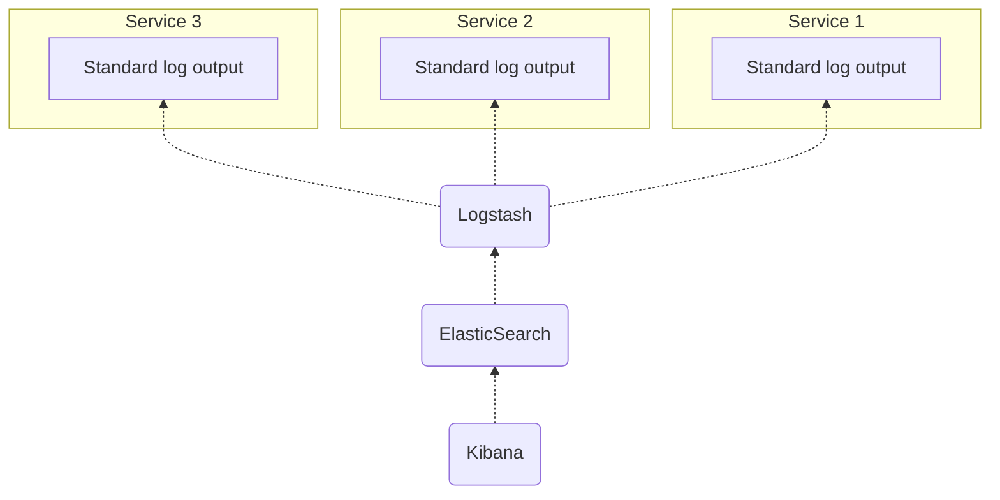

I have been building aggregated logging mechanisms in all my projects and I always thought of it as an industry standard practice. Lately I've noticed that this is not the case and lots of people are not taking it seriously.

This post is an attempt to gather my thoughts on the subject and hopefully help others understand it. Here it comes.

## Why logging
OS processes that usually run web applications are always bound to the standard output. Can be a file, the terminal or a GUI made by the hosting provider. Whatever that is, I usually tend to throw a bunch of logging statements to my functions to be able to trace their execution trail later.

It's also useful to pack those traces with metadata. A request for password reset was initiated by a **specific user** or the creation of a **specific TODO item** failed yesterday. Hopefully, I will be able to trace back those requests and see more information.

Say for the password reset request we will end up having something like this:

```
82c838eb-736a-447b-b9e1-10dfe2bbe575 - Tue, 04 Dec 2018 20:27:16 GMT - POST /user/resetPassword - Initiated
82c838eb-736a-447b-b9e1-10dfe2bbe575 - Tue, 04 Dec 2018 20:27:16 GMT - User 145123 requested to reset password
82c838eb-736a-447b-b9e1-10dfe2bbe575 - Tue, 04 Dec 2018 20:27:16 GMT - User found, resetting password
82c838eb-736a-447b-b9e1-10dfe2bbe575 - Tue, 04 Dec 2018 20:27:16 GMT - Password reset
82c838eb-736a-447b-b9e1-10dfe2bbe575 - Tue, 04 Dec 2018 20:27:16 GMT - Attempt to send email
82c838eb-736a-447b-b9e1-10dfe2bbe575 - Tue, 04 Dec 2018 20:27:16 GMT - Email sent
82c838eb-736a-447b-b9e1-10dfe2bbe575 - Tue, 04 Dec 2018 20:27:16 GMT - POST /user/resetPassword - 200 OK
```

The above is a simplified example but you can see the detail granularity that we have already. We could easily spot an exception thrown in the middle of the process, find out its the exact time and reason about our system's behavior.

But the above will quickly result to lots of lots of logs especially in a high traffic environment. Fortunately, there are the tools that will help us find the information we need much easier.

## Why aggregated
By aggregating those logs, we are implying that there are more than one processes or even completely independent systems that will generate logs. Indeed, even the smallest web application will be consisted of various parts like several instances of our app that exposes a REST API, the database and possibly a load balancer. Instead of having different places to check for your logs, it would be easier to aggregate all these in the same place and be able to traverse them all together.

Even better, we could trace the execution across our different systems, see any type of log or error that may arise during the request. Our code could be all valid but we may have forget to add an index in our DB.

## The ELK model
As with every brilliant idea in this industry, ELK strives for separation of concerns. ELK stands for **E**lasticSearch, **L**ogstash and **K**ibana. It combines those three tools in order to put a great log aggregation system in place.



ElasticSearch uses Lucene under the hood. It will store and index our logs for us to be able to search in them. Logstash (now Filebeat) is responsible for wiring the standard outputs of our systems with ElasticSearch and finally Kibana is the GUI that will help us traverse our logs and create charts and visualizations.

## Self hosted
ELK stack is open source and can be self hosted by you. As with all self hosted software, though it means that you may have to monitor the ES cluster and provide regular updates to Kibana.

AWS provides a managed service to create ES cluster of which they come with [Kibana installed as a plugin](https://docs.aws.amazon.com/elasticsearch-service/latest/developerguide/es-kibana.html). You could also self-host Kibana your self in an ECS task to have more freedom over it.

## 3rd-party solutions
[papertrail](https://papertrailapp.com/) is a great log management tool to centralize your logs in a single place. In contrast with ELK, papertrail is only a simple terminal where you can search for text occurrences. It doesn't provide the analytics and visualizations features of ELK.

[Loggly](https://loggly.com) is similar to ELK and provides all of it features plus a few more, like alarms. Alarms can be handy when you need to be notified e.g. when a certain occurrence comes up or when the number of a computed field exceeds a certain threshold.

[Cloudwatch](https://aws.amazon.com/cloudwatch/) is AWS's native solution for managing logs in their cloud. If you're using EC2 for example you will be able to find each instance's logs in Cloudwatch. From there you can search in them, create triggers on specific text occurrences or even redirect them to other services. You could stream those logs (using Lambda functions) to an external ELK based stack such as Loggly or AWS ElasticSearch cluster.

<small>*Both papertrail and Loggly are now owned by the same company, but that was not the case when I was first introduced to them. I am not affiliated by this company in any way.*</small>

## The log standard
For the indexing service to be able to better parse and analyze your logs, you must be able to provide a standard log format. There is no standard log standard that everyone uses but rather it seems like it is different for every case.

Node.js' bunyan logger that is extensively being used [provides a good starting point](https://github.com/trentm/node-bunyan#core-fields).

```
{
  "name": "myserver",
  "hostname": "banana.local",
  "pid": 123,
  "req": {
    "method": "GET",
    "url": "/path?q=1#anchor",
    "headers": {
      "x-hi": "Mom",
      "connection": "close"
    },
    "remoteAddress": "120.0.0.1",
    "remotePort": 51244
  },
  "level": 3,
  "msg": "start request",
  "time": "2012-02-03T19:02:57.534Z",
  "v": 0
}
```

The above will be parsed and indexed by ES so you will be able to search and aggregate them.

Imagine that you wake up in the morning and you read support request from a customer who tried to use your service while you were sleeping but couldn't. What could have gone wrong? You will be able to answer it by searching those logs, see the path that the user took before crashing and eventually find the error along with the stack trace.

But this not the only valuable information we can get out of this.

## Analytics
By having these information stored, other interesting answers are coming out:

* What's the most used API path?
* Do we get any suspicious headers?
* Add the HTTP status code in the mix: How many 500 are we getting?
* Add the username in the mix: Audit a particular's user activity

*<small>Be careful with what user identifying information you are storing. 2018 was the year that [GDPR came](https://en.wikipedia.org/wiki/General_Data_Protection_Regulation) in practice. By storing (or even worse, providing information to 3rd-party services such as Loggly) user identifiable information you are in violation of the GDPR law.</small>*

See how you are able to answer basic questions (or even more complex ones) for your HTTP traffic, systems execution or even business specific operations.

## Conclusion
I consider log management to be a foundational piece for every software architecture. I would always design it and have it available as early as possible.

As the architecture grows, log management can be a tedious task but till then, small to medium size architecture should have a way to:

* Trace back in time execution of individual requests
* Analyze and answer basic questions about your architecture
