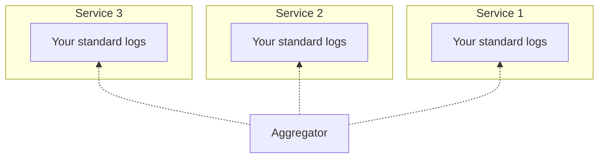

This is an attempt to write about aggregated logging.

Before that I would like to test [mermaid](https://mermaidjs.github.io/)
along with Gatsby.

Here it goes:

Imagine multiple services that log to stdout

