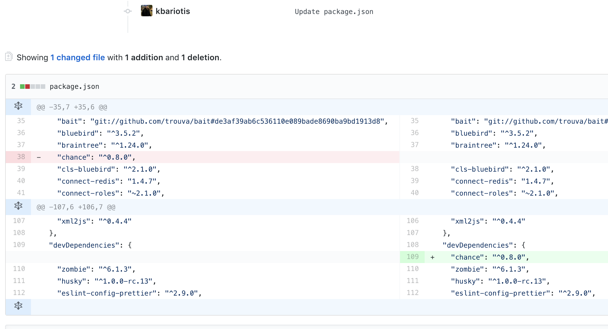

I broke our main API last week. I merged a PR of mine I had been working for a while. It got two approvals from two co-workers, green test suite and it was working perfectly fine locally and on our staging environment, the one that we test things before we send them to production. Somehow, the Node.js server failed to boot on production and we had to rollback to the last deployment, resulting into a 2-3 minutes downtime.

Why did the Node.js server failed to boot on production while was
working perfectly fine locally and on our pre-production staging
environment? Keep reading.

## What happened?

Wanna see the PR that brought our production down? Here it is:

I literally moved a dependency from the `dependencies` section to `devDependencies`. Reinstall my dependencies locally and rerun the server and was working perfectly. I then deployed to our staging and again, worked perfectly fine. But, failed to boot on production.

Specifically, the production server failed to boot cause it wasn't able to find the `chance` module.

Yes! That's obscure! Well not so much. Let's take it from the beginning.

The Node.js server was mostly running in three different environments. It was using the `NODE_ENV` to denote the current environment. It could take three different values based on where it was running, `development` for when it was running locally, `staging` for when it was running on our staging environment and `production` for when it was running on our production environment.

Now here's an interesting piece from `npm` [docs](https://docs.npmjs.com/cli/install#description):

> With the --production flag (or when the NODE_ENV environment variable is set to production), npm will not install modules listed in devDependencies.

Yes! The `NODE_ENV` will actually impact your production environment and will enlarge the gap between production and other environments. Let's revisit a famous quote from the [The twelve-factor app](https://12factor.net/dev-prod-parity):

> Keep development, staging, and production as similar as possible.

Unfortunately, by setting our `NODE_ENV` to a value based on
the current environment it was running on, we were actually making our environments parity bigger.

The immediate action we took after that incident was simple. To decouple our
application environment from `NODE_ENV`. We introduced the `APP_ENV` variable,
renamed all `NODE_ENV` occurrences to that and then moved `NODE_ENV` to only
have values `development` when running locally or while running unit tests
and `production` for all other environments.

Another aspect of this is that some other library may be using this variable
as well without even knowing about it. And it won't be looking for multiple values, it will only be looking for `production` vs anything else.

Now where did `NODE_ENV` came from and why does npm actually uses it? Node.js documentation mention nothing about such a variable. Well the `NODE_ENV` variable became famous from the [Express.js](http://expressjs.com/) framework where it was using it to decide whether it should enable some development features on production. After people started to use it, other projects started to adopt it as well and we reached today.

## To conclude
Choosing `NODE_ENV` to denote your application's environment is not wise
since so many utilities around depend on it. Keep it to mark online
production-like environment vs local development environments.

Like I mention above, we learned quite a few things from that incident, but
our immediate action was to rename `NODE_ENV` in an attempt to keep to our online environments as similar as possible. 🤓

Were there any actions or decisions you took recently to address this issue?
