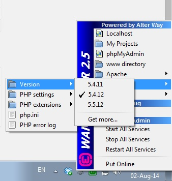

Having an easy way to switch PHP version is indeed a neat feature. Wampserver makes it easy for developers (like me!!) who works on Windows. Here's how.

First if you haven't update your WAMP installation for a while here's a chance to do it. Keep a backup of your configuration files and your database, then remove WAMP from <strong>Programs and Features. </strong>Download the latest <a title="Wampserver" href="http://www.wampserver.com">WAMP</a> and install it. Then restore you backups. Now you should have the latest build of Apache/PHP/Mysql.

But you also need a previous version of PHP. What about it? Well it's easy. Download the version you need from <a title="PHP releases for Windows" href="http://windows.php.net/downloads/releases/">here</a>. Create a folder under [WAMP_FOLDER]/bin/php/ with the name 'php' and the version you have just downloaded and extract the contents of the zip file there. There it should have another folder which is the current PHP version of WAMP.

Now we need a last thing for the WAMP server to recognize this install. Copy from the default PHP version's folder three files:
<ul>
	<li>php.ini</li>
	<li>phpForApache.ini</li>
	<li>wampserver.conf</li>
</ul>
and paste them on the folder you have just created. Change the 'extension_dir' setting from the first two files and open the third and make any appropriate changes.

Terminate WAMP and run it again, n<strong>ot just restart it's services.</strong> And there you have it. Multiple PHP versions in just a click. Sweet right?

*UPDATE (20/09/2014) : Remember to download the Thread Safe version of PHP. Here's a brief <a title="Thread Safe VS Non Thread Safe PHP" href="http://stackoverflow.com/a/3983918/1955940" target="_blank">explanation </a>on what's the difference.*

