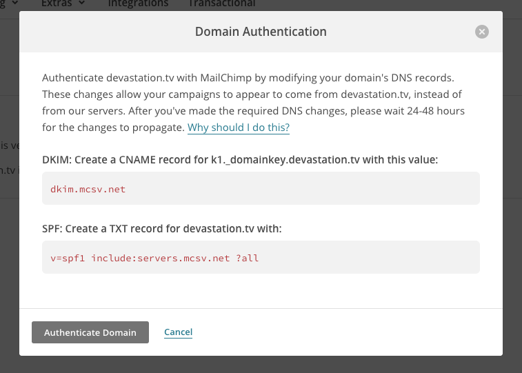
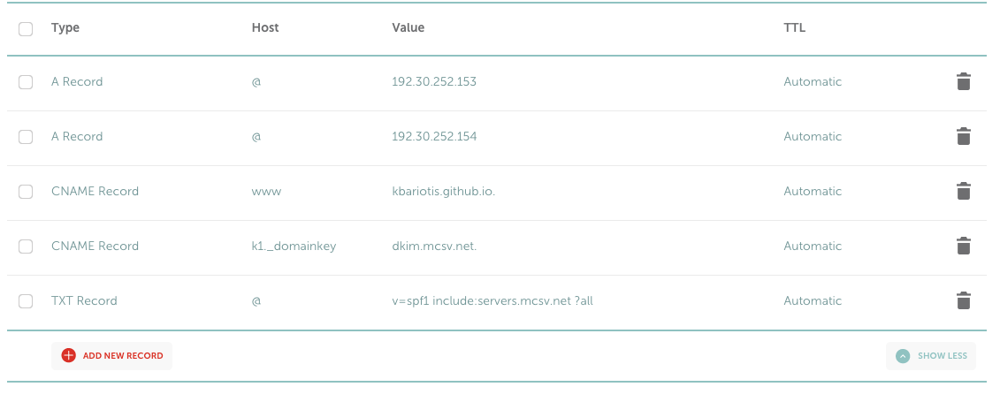

If you, like me, like to host simple little sites of yours on GitHub Pages, I am sure you have already reached the moment when you wanted to send emails from that site but you didn't know how to. This is how I did it.

[devastation.tv](http://devastation.tv), my podcast for developers (for the time in Greek only) is hosted on [GitHub Pages](https://github.com/kbariotis/devastation-podcast) with a custom domain that I have purchased from [Namecheap](https://namecheap.com). I wanted to be able to send email campaigns to my subscribers whenever a new episode is out.

[Mailchimp](https://mailchimp.com) helped me a lot on my first campaigns but I would send those emails using my personal Gmail account, which is both ugly for the subscriber to see and is [also dangerous](http://kb.mailchimp.com/accounts/email-authentication/about-dmarc?_ga=1.191860521.246269979.1477844435) cause it may end up in my subscriber's Spam folder.

Last but not least, I knew my subscriber list would take a long time until it go big and I didn't want to pay for a paid subscription, e.g. to Gmail for Work (£3.30 per user per month). I had to find a cheaper way, and Mailchimp has a great starter package with up to 2,000 subscribers and 12,000 emails per month.

So here's a simple solution that involves having your site hosted on GitHub Pages, using Mailchimp for sending email campaigns and Namecheap as your domain registrar.

## Receiving emails
For receiving emails, Namecheap has this great [email forwarding feature](https://www.namecheap.com/support/knowledgebase/article.aspx/308/76/how-can-i-set-up-free-email-forwarding-for-my-domain) that allows you to forward an incoming email to your domain in an external email. So I put my personal Gmail email there and I am able to receive emails.

## Sending emails
Now Mailchimp allows you to [add a custom domain](http://kb.mailchimp.com/accounts/email-authentication/set-up-custom-domain-authentication-dkim-and-spf) to be able to send emails that originated from that domain. You need to verify this domain before you're able to send emails, so all you have to do is add a few records in your DNS settings and you are good to go. These are the instructions from Mailchimp.

And this is a screenshot from my DNS configuration from Namecheap.

The first three records are my GitHub Pages DNS records for the redirection to work. The last two are the Mailchimp records that are needed for the verification process. **Be careful cause they are not the same as the picture above. Won't work on Namecheap as is.**

So how do you handle your emails when on GitHub Pages?

