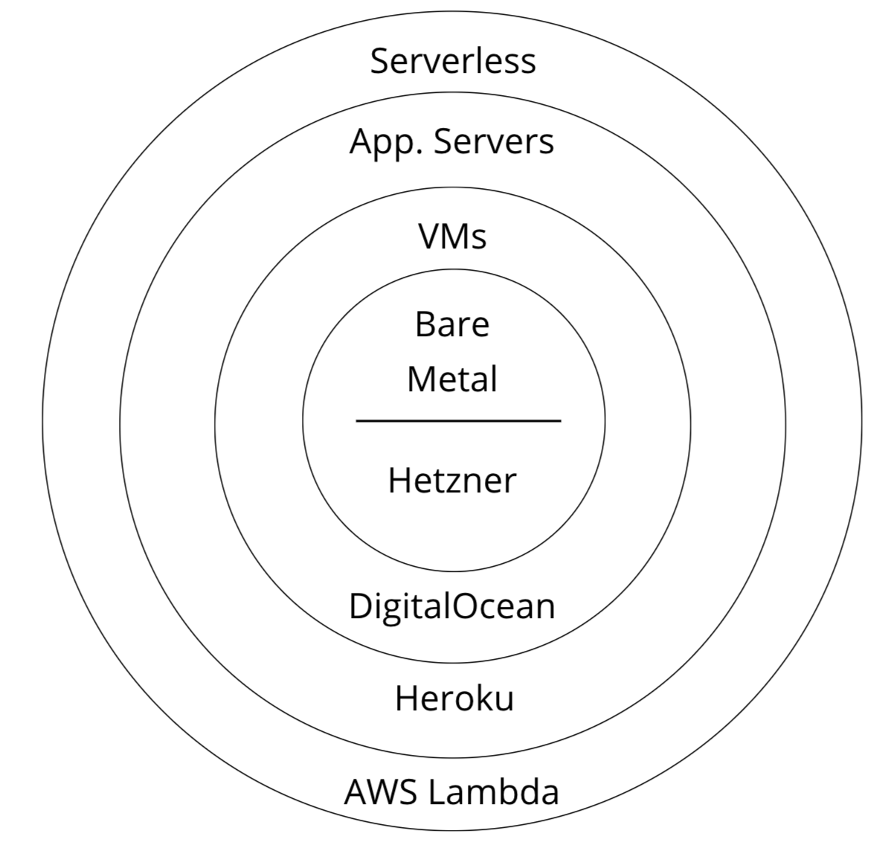

This post will be an attempt for me to start talking about the, all heard about it, serverless thing. I have been working with a serverless architecture on top of AWS for the last few months and I am feeling like I have a complete picture about it and a lot to share.

I have gathered quite a few subjects I would like to write about but this post will be just an introduction and my point of view on serverless.

## "Serverless"? as in "without servers"?
Let us please start with the elephant in the room.

> *Serverless doesn't mean no servers.*

<iframe src="https://giphy.com/embed/j2nATOAdRgYZq" width="374" height="380" frameBorder="0" class="giphy-embed" allowFullScreen></iframe>

It simply means that the underlying servers are being hidden from the developer. Like when you are talking with the GitHub API, the underlying infrastructure is completely hidden from you and you don't have to worry about it.

It is a rather confusing term, but don't let it fool you. You will still have to manage some kind of an infrastructure.

## What is serverless
From setting up a load balancer, ensuring that your platform can perform good at scale and setting up the build server for your CI/CD process, the infrastructure part of software development is one big chapter.

Serverless is the state where all of the above are abstracted away and hidden behind APIs that you can manage them through.

The diagram below illustrates how serverless is the evolution of Platform as a Service providers such as Heroku.

The Function as a Service that we are hearing a lot, and usually comes in conjuction with the serverless term, is just a language runtime hidden behind an API. With AWS Lambda, e.g. what I can do is to make a POST request on their API with some Node.js source code and it will return me a UID that I can use on another POST request to run it. That's it. No cluster setup, no ports binding. It's just takes my code and runs it.

Serverless hides its roots in the microservices architectures were bigger and complex systems are being broken out in multiple isolated services. The goal is to abstract away complex parts of our codebase from the other developers and let them interact with those through an API.

And like a monolith that you decided to break it down in smaller services, is something that you can progresivelly fade in. You don't have to go one hundred percent serverless.

## Functions/Database/Router/etc... as a Service

Think of a simple CRUD REST API. We need a database, a runtime to run our code and an HTTP proxy/router. Each of these has its own caveats and things that we have to take actions for. Database needs indexing and backups operations, our runtime needs a scaling protocol and the proxy needs an authentication mechanism.

> *Anything that can be abstracted away, will be abstracted away.*

By putting all of the above, behind an API(one API for each service, remember the bounded context?) and let them take handle of their own issues, the only thing we left with is "our code".

It's a form of outsourcing really, with a more simplified communication process.

[Jeff Bezos once](https://plus.google.com/+RipRowan/posts/eVeouesvaVX) instructed every team inside Amazon to have a developer that will create an API for that team and let all teams communicate only through these APIs. Thus AWS was born. Serverless is that particular mindset in scale.

## Not simpler

> *Now you are able to focus on writing your code...*

I know. Such a cliche.

In reality, it's not that simple. And while I am feeling like we are getting there, it's still not possible.

While serverless and the current state can boost development, it's still not that simple. You still need to have a knowledge of how servers works, basic understanding of distributed systems and security.

On top of that, each external API has each own caveats and terminology you will need to get familiar with.

There are also cons that you will have take in consideration, such as the vendor lock in. Out sourcing your work means that you are bringing in partners. You need to think about each and every one of them.

The development tools around a serverless architecture is also still a blurry place to be. A local development will be hard, often times impossible to setup. Consider that early in your architecture design in order to avoid surprises later on.

## Conclusion
Serverless is an amazing technology, or a mindset if you will. Major providers such as AWS and Google Cloud brought it to the next level and if you haven't played with them even for a while, I am suggesting you to do so. Just to take a look.

I'am not sure if it will transform the way we structure and develop our architectures, but it's certainly a very interesting field to explore.

I will continue writing about various serverless topics that I have found interesting and challenging on my journey.

Leave me a comment about the part about serverless that confuses the most.
